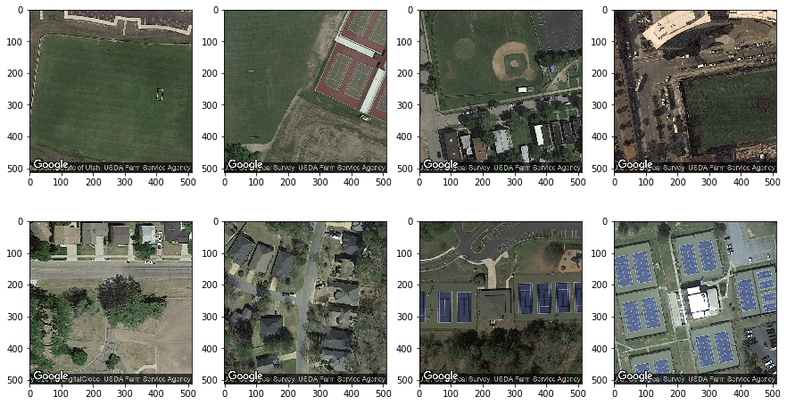

# Detecting tennis courts on satellite images
This is a demonstraction of how Deep Learning can be used to build an object detector in satellite images. In particular, I trained a tennis court detector using Google's 'Places' and 'Maps' APIs.

Steps 1 and 2 describe how to train your own tennis-cout detector model from examples in Google Maps. They can be skipped if you are only interested in testing the model. 

## Step 1: Create a training dataset
First, we need to build a labeled dataset of images of the 'tennis court' and the 'no tennis court' classes. For that, we use Google's 'Places' API to find geolocations of tennis courts and other objects and the 'Maps' API to download a their corresponding images.

To download the dataset, use the next program:

```
$ python3 build_labeled_dataset.py -h
Usage:
Reuse dataset:
   build_labeled_dataset.py <google_maps_API_key> <data_destination>

Search new dataset:
   build_labeled_dataset.py <google_maps_API_key> <data_destination> <google_places_API_key>

Obtain Google Maps   credentials at https://developers.google.com/maps/documentation/javascript/get-api-key
Obtain Google Places credentials at https://developers.google.com/places/web-service/get-api-key
```

Here you have some examples in the dataset

```python
from skimage.io import imread
import matplotlib.pyplot as plt
import os

plt.figure(figsize=(15,8))
file_list = [fname for fname in os.listdir('image_examples/')]
for c,fname in zip(range(len(file_list)),file_list):
    im = imread('./image_examples/'+fname)
    plt.subplot(2,4,c+1)
    plt.imshow(im)
plt.show()
```





## Step 2: Train a classifier
Second, train a classifier with the downloaded dataset of images. I designed a Convolutional Nerual Netowrk (CNN) with 4 convolutional and 2 fully connected layers, which can be trained using:

```
$ python3 train_tennis_model.py -h
Usage:
   train_tennis_model.py <path_to_data>
```

## Step 3: Download a big scene
You can download all the tiles (256x256 pixel each) corresponding to a scene from Google's Maps. The tiles have a 50% overlap to ensure all objects are completely included in at least one imgage.

```
$ python3 download_scene.py -h
Usage:
   download_scene.py <minimum_latitude> <minimum_longitude> <maximum_latitude> <maximum_longitude> <scene_name> <google_maps_API_key>
```

Here you have an example of how to download the tiles corresponding to the city of San Francisco:

```
$ python3 ./download_scene.py 37.746801 -122.517113 37.810798 -122.398028 sanfrancisco <google_maps_API_key>
```

## Step 4: Test the model with the scene's tiles
Once, you have a scene downloaded, you can apply the model to each tile in the scene by using:

```
$ python3 pred_dataset.py -h
Usage:
   pred_dataset.py <path_to_scene> <path_to_model> <output_file>
```

To use the pretained model, use the following file:

```
weights_strong.hdf5

Example:
python3 pred_dataset sanfrancisco weights_strong.hdf5 results.csv
```

## Step 5: Display the results
Finally, here you have an example of how to display the results obtained in an interactive heatmap showing the scores of the detector. To do so, use the geographical locations of the tiles, which were saved in the 'geodata.csv' file produced by 'download_scene.py'


```python
import gmaps
import gmaps.datasets
import pandas as pd
```

Use your own key here:


```python
gmap_key = 'YOUR_KEY'
```


```python
import math
dfres = pd.read_csv('results.csv')
contrast_score = [math.exp(-6*(x-0.9)) for x in dfres['strong_score'] ]
contrast_score = [1/(1+x) for x in contrast_score ]
dfres[dfres['strong_score']<0] = 0
dfgeo = pd.read_csv('geodata.csv')
data = pd.merge(dfres,dfgeo, on='file_name', how='inner')
locations = [(data.iloc[ind][4],data.iloc[ind][5]) for ind in range(len(data))]
figure_layout ={'width': '750px',
                 'height': '550px',
                 'padding': '3px',
                 'border': '1px solid black'}
fig = gmaps.figure(map_type='SATELLITE',layout=figure_layout,center=(37.778661,-122.463640),zoom_level=13)
heatmap_layer = gmaps.heatmap_layer(locations,
                                  weights=contrast_score,#data['strong_score'],
                                  dissipating=False,
                                  point_radius=0.0007,
                                  opacity=0.5,
                                  max_intensity=1)
heatmap_layer.gradient = [
    (255,0,0,0),
    (255,0,0,1)
]
fig.add_layer(heatmap_layer)
```

You can find the interactive map in the following link:


```python
from ipywidgets.embed import embed_minimal_html
embed_minimal_html('SFtennis.html', views=[fig], title='San Francisco tennis courts')
from IPython.core.display import HTML
display(HTML('<a href="https://cdn.rawgit.com/ohcaude/tennis/75a2f8ed/SFtennis.html">San Francisco tennis courts</a>'))
```


<a href="https://cdn.rawgit.com/ohcaude/tennis/75a2f8ed/SFtennis.html">San Francisco tennis courts</a>

